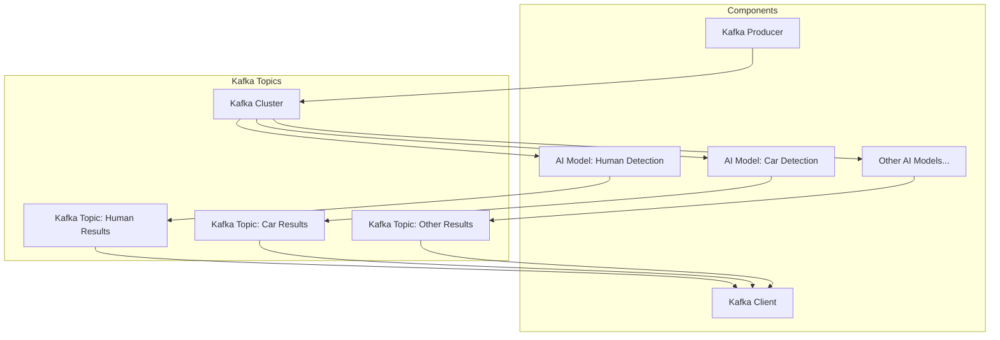

# kafka-learning

This project is focused on learning and implementing Apache Kafka for real-time data processing. The main components of the project include a Kafka producer, a set of AI models acting as Kafka listeners, and a Kafka client.

## Project Components

1. **Kafka Producer**
   - Responsible for writing frames into Kafka clusters.
   - Acts as the data source for the Kafka ecosystem in this project.

2. **Kafka Listeners (AI Models)**
   - A set of AI models designed to read from specific Kafka topics.
   - These models perform object detection tasks such as human detection, car detection, etc.
   - The results of these detections are written to other Kafka topics for further processing or analysis.

3. **Kafka Client**
   - Designed to choose relevant topics and read data from them.
   - Provides an interface for accessing processed data from the Kafka ecosystem.

## Getting Started

To get started with this project, you will need to have Apache Kafka installed and configured. Follow the official [Kafka documentation](https://kafka.apache.org/documentation/) for installation instructions.

## Architecture

## Usage

1. **Start Kafka Cluster**
   - Ensure your Kafka cluster is running.

2. **Run Kafka Producer**
   - Execute the Kafka producer to start sending frames to the Kafka cluster.

3. **Deploy AI Models**
   - Deploy the AI models to start listening to the Kafka topics and processing data.

4. **Use Kafka Client**
   - Use the Kafka client to read from the relevant topics and access the processed data.

## Contributing

Contributions are welcome! Please feel free to submit a pull request or open an issue for any improvements or suggestions.

## License

This project is licensed under the MIT License. See the [LICENSE](LICENSE) file for more details.